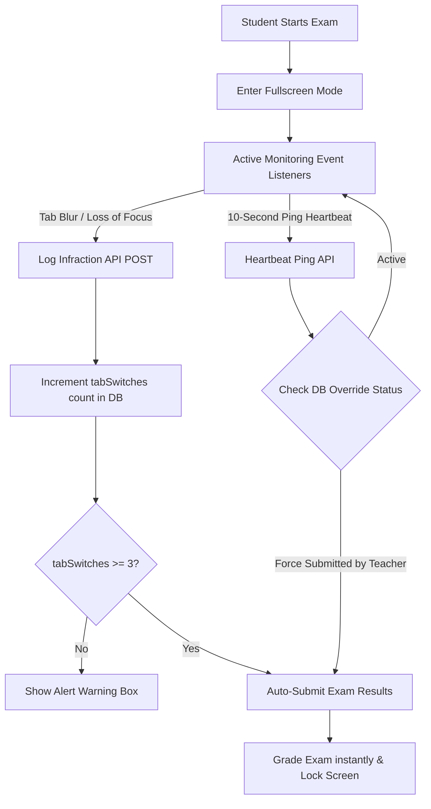

# Manna CBT System - Comprehensive Technical & Implementation Documentation

Welcome to the technical documentation of the **Manna Computer-Based Testing (CBT) System**. This document provides an in-depth breakdown of the systems, features, architecture, database schemas, and technical enhancements implemented throughout the codebase.

---

## 1. System Overview & Technology Stack

The Manna CBT System is a high-performance, robust, and secure web application designed to schedule, administer, monitor, and review school examinations. 

*   **Frontend Framework**: Next.js 16 (App Router) & React 19.
*   **Styling**: Modern, responsive CSS tailored with Tailwind CSS v4 and vanilla CSS variables for layouts.
*   **Icons**: Lucide React for consistent and crisp vector icons.
*   **Database ORM**: Prisma 7.
*   **Database Engine**: PostgreSQL (migrated from SQLite for high concurrency and enterprise production support).
*   **Authentication & Security**: Stateful JWT cookie-based authentication via `jose`.
*   **Math Rendering**: KaTeX (embedded dynamically client-side and server-side).
*   **PDF Report Engine**: Puppeteer-Core, utilising local Chrome/Edge binary execution to render exact A4 format reviews.

---

## 2. Database Architecture & Schema

The database schema has been engineered to support scheduling, attempts tracking, proctor logs, subjects, classes, and question reports.

### Entity-Relationship Diagram (ERD)

```mermaid
erDiagram
    User ||--o{ Question : "creates"
    User ||--o{ StudentAttempt : "makes"
    User ||--o{ Result : "has"
    User ||--o{ QuestionReport : "reports"
    User ||--o{ Class : "belongs to / teaches"
    User ||--o{ ExamSession : "participates in"
    Class ||--o{ User : "has students"
    Class ||--o{ Exam : "schedules"
    Class }o--o{ Subject : "shares"
    Subject ||--o{ Question : "contains"
    Subject ||--o{ ExamSubject : "maps questions count"
    Subject ||--o{ StudentAttempt : "linked"
    Exam ||--o{ ExamSubject : "has configuration"
    Exam ||--o{ ExamSession : "monitors"
    Exam ||--o{ StudentAttempt : "groups"
    Exam ||--o{ Result : "results in"
    Question ||--o{ StudentAttempt : "gets answered"
    Question ||--o{ QuestionReport : "has issues"
```

### Models breakdown

1.  **User**: Stores identities and credentials of `ADMIN`, `TEACHER`, and `STUDENT` accounts. Connects students/teachers to classes and tracks passport image URLs.
2.  **Class**: Groups students and exams under specific academic sessions (e.g., "SS3 Gold", "2025/2026").
3.  **Subject**: Represents academic subjects (e.g., "Mathematics") associated with teachers and classes.
4.  **Question**: Holds question content. Supports multiple-choice options (`optionA` to `optionF`), correct answers, image assets (diagrams), passage titles/texts (reading comprehension), and specifies `questionType` (`MCQ` or `THEORY`).
5.  **Exam**: Schedules exam titles, start/end windows, durations, draft/live status, and contains administrative flags like `resultsReleased`.
6.  **ExamSubject**: A join table mapping how many questions from each subject are assigned to a specific exam.
7.  **StudentAttempt**: Logs every option a student selects in real time, storing exact choices and flags for review.
8.  **Result**: Stores final calculated scores, total questions, and time spent.
9.  **QuestionReport**: Allows students to flag errant questions during tests so teachers can correct typos or issues.
10. **ExamSession**: **(Proctoring Core)** Logs student IP addresses, user-agents, start times, heartbeat pings (`lastPing`), focus infractions (`tabSwitches`), and session status (`IN_PROGRESS` or `SUBMITTED`).

---

## 3. Implemented Features

### 3.1. User Authentication & Responsive Design
*   **Role-Based Security**: Access-restricted directory routing (`/admin`, `/teacher`, `/student`) using Next.js middleware and JWT cookie validation.
*   **Mobile Adaptability**: The teacher and student dashboards are fully mobile responsive. Collapsible sidebars, flexible CSS grid panels, and adaptive headers ensure a native feel on tablets and phones.
*   **Header Refinements**: Added explicit "Log out" text and buttons to resolve usability complaints on smaller screens.

---

### 3.2. Dynamic Exam Engine (MCQ & Theory Support)
The test-taking environment was updated to support multiple question types side-by-side:

*   **MCQs (Multiple Choice Questions)**: Supports 2 to 6 options (A through F). Options are shuffled deterministically based on the student's unique ID, preventing adjacent cheating.
*   **Theory (Written Answer Questions)**: Integrated a written answer text box next to theory prompts, allowing students to type paragraphs or formulate complex text answers, saved directly to the database attempts.
*   **Draft & Release Flow**: Exams are simplified with status toggles (`Open` or `Close`) and scheduling dates. Results are hidden from students until the teacher flips the `resultsReleased` flag.

---

### 3.3. Advanced Question Bank & Word (.docx) Importer
Teachers can populate their question databases manually or via bulk uploads:

*   **Manual Entry**: Cleaned-up editor interface, removing unnecessary "difficulty" and "tags" inputs to speed up standard data entry.
*   **Bulk Word Importer**: 
    *   Integrates `mammoth` to parse text and structures from Microsoft Word documents.
    *   Parses question text, options (matching A. through F. formats), and answer lines (e.g., `Answer: B`).
    *   Filters out HTML boilerplates, validates counts (flagging questions with less than 2 or more than 6 options), and checks that the designated correct answer actually exists in the options list.
    *   Provides high-quality diagnostics on upload errors, naming the specific question number and description where the parser failed.

---

### 3.4. KaTeX & Math Formulas Integration
A key requirement for science and math examinations is rendering complex mathematical formulas without text breaking:

*   **Toolbar Safe Escaping**: Rich text editor strings are escaped on the server to prevent HTML injection, while selectively allowing formatting structures (`<b>`, `<i>`, `<sup>`, `<sub>`, `<br>`) to render safely.
*   **KaTeX Processor**: Mathematical segments enclosed in `$$` (display mode) or `$` (inline mode) are automatically parsed and translated into vector math equations.
*   **Cross-Platform Consistency**: The KaTeX translation engine runs on the client dashboards (using the `MathRenderer` component) and pre-compiles server-side in the PDF generator so that printed sheets reflect the equations beautifully.

---

### 3.5. Real-Time Security & Proctoring System

To prevent cheating during examinations, a multi-layered lockdown and monitoring framework was built:



*   **Blur & Focus Detection**: The student's browser window attaches `blur` listeners. The moment a student switches tabs, opens another browser, or minimizes the window, an API request logs the infraction.
*   **Lockdown Auto-Submission**: On the 1st and 2nd infractions, the student receives a warning alert box. Upon the 3rd infraction, the exam is immediately auto-submitted, their sheet is graded, and their session is locked.
*   **Proctoring Heartbeat (Ping API)**: A 10-second interval heartbeat pings `/api/student/test/ping`. It monitors student activity and detects if a teacher has manually override-submitted their paper, redirecting them instantly to the home dashboard.
*   **Teacher Proctor Dashboard**:
    *   Live panel displaying active sessions for scheduled exams.
    *   Data updates automatically in the background (polls every 5 seconds).
    *   Displays: Student Name, Roll Number, Session Status (`ONLINE`, `OFFLINE`, `SUBMITTED`), total `tabSwitches` count, IP Address, browser User-Agent details, and live grading results.
    *   Provides a **Force Submit** button, giving teachers immediate authority to terminate and grade any student's paper remotely.

---

### 3.6. In-Line PDF Exam Review Engine
Once results are released, students can view their corrected exam paper and download a review document:

*   **PDF Generation on Host**: The API endpoint `/api/results/[examId]/download-review` spins up a headless Puppeteer browser (using local Chrome or Edge binaries) to construct a high-resolution, print-ready A4 PDF.
*   **Deterministic Shuffle Matching**: Because questions are randomized dynamically to prevent cheating, the PDF generator reconstructs the exact layout that *that specific student* saw by applying a deterministic hash function (`studentId + questionId`) to the question list.
*   **Visual Enhancements**:
    *   Official PDF header featuring the Kaduna State Crest & Manna Academy branding.
    *   Student bio-data box containing scores, duration, and completion timestamp.
    *   Styled cards showing Question text, passages (for comprehension questions), and options.
    *   Custom color-coded indicator badges:
        *   `✓ Correct & Your Choice` (Green background/border, checked symbol).
        *   `✓ Correct Answer` (Green border, showing what the answer was if the student missed it).
        *   `✗ Your Choice (Incorrect)` (Red background/border, indicating the student's wrong selection with strikethrough text).

---

## 4. Infrastructure & Deployment Enhancements

### 4.1. SQLite to PostgreSQL Migration
To support concurrent write operations when hundreds of students log attempts and heartbeat pings simultaneously, the datasource was migrated:
*   Set provider to `postgresql` in Prisma.
*   Integrated `@prisma/adapter-pg` driver adapter.
*   Updated database configuration references to clean deprecated URL fields.

### 4.2. Automated Pre-Build DB Sync Hook
Deploying Next.js code to cloud servers (such as Railway or Vercel) can cause database/model mismatches if build scripts run before schemas are synchronized. 
*   **Solution**: Created a custom script `scripts/db-push.js` which automatically loads environmental variables and executes `npx prisma db push` only when a `DATABASE_URL` is present.
*   **Integration**: Wired directly as a pre-build requirement in `package.json` (`"build": "node scripts/db-push.js && next build"`), ensuring zero-downtime, automated database schema updates upon every code deployment.

---

## 5. Summary of Files Created & Modified

Below is a detailed map of files edited or introduced during these enhancements:

| Component | File Path | Action | Description |
| :--- | :--- | :--- | :--- |
| **Database** | `prisma/schema.prisma` | **Modify** | Added ExamSession model, proctoring attributes, and postgresql configurations. |
| **Database Sync** | `scripts/db-push.js` | **New** | Custom automated prisma database sync hook for builds. |
| **Math Renderer** | `src/components/MathRenderer.tsx` | **New** | Math formula layout processor using KaTeX. |
| **PDF Route** | `src/app/api/results/[examId]/download-review/route.ts` | **New** | Puppeteer-core PDF compilation, LaTeX pre-rendering, and layout generator. |
| **Infraction API** | `src/app/api/student/test/log-infraction/route.ts` | **New** | Tracks blur events, increases switch warnings, grades, and auto-submits. |
| **Ping API** | `src/app/api/student/test/ping/route.ts` | **New** | Heartbeat controller tracking student activity and force-submits. |
| **Proctor API** | `src/app/api/teacher/exams/[examId]/proctor/route.ts` | **New** | Provides live session telemetry grids and force-submit hooks. |
| **Student UI** | `src/app/student/test/[examId]/page.tsx` | **Modify** | Standardised test engine, blur listeners, auto-saves, and math widgets. |
| **Teacher UI** | `src/app/teacher/page.tsx` | **Modify** | Integrates proctor grids, scheduler improvements, state-saving class selectors, and search filters. |
| **Question UI** | `src/app/teacher/questions/new/page.tsx` | **Modify** | MCQ and Theory inputs, Word file import buttons, and error diagnostic logs. |
| **Word Parser** | `src/utils/docxQuestionParser.ts` | **New** | Bulk Word file parsing engine. |
| **Word Test** | `src/utils/docxQuestionParser.test.ts` | **New** | Test cases for the Word importer. |
